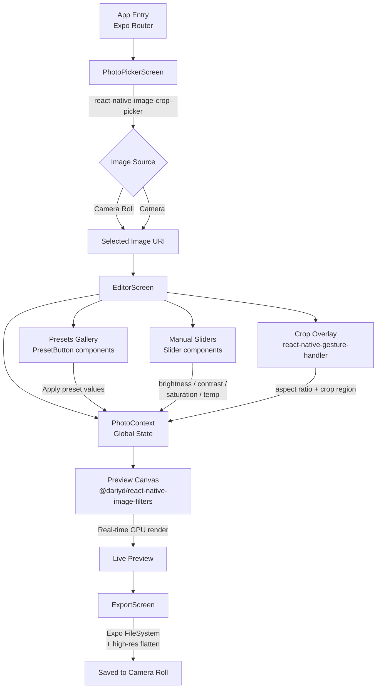
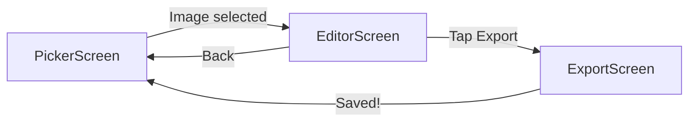

# Lightroom-Copy Mobile Photo Editor — Build Plan

## Architecture Flowchart



---

## Tech Stack

- **Framework:** React Native + Expo SDK (EAS custom dev client, TypeScript)
- **Navigation:** Expo Router (file-based)
- **Styling:** NativeWind (Tailwind CSS for React Native)
- **State:** React Context (`PhotoContext`)

## Key Libraries

| Purpose                    | Library                                   |
| -------------------------- | ----------------------------------------- |
| Image picking & basic crop | `react-native-image-crop-picker`          |
| Filters & GPU adjustments  | `@dariyd/react-native-image-filters`      |
| Custom crop overlays       | `react-native-gesture-handler`            |
| Sliders                    | `@react-native-community/slider`          |
| Export / file save         | `expo-file-system` + `expo-media-library` |

---

## Folder Structure

```
lightroom-copy/
├── app/                          # Expo Router screens
│   ├── _layout.tsx               # Root layout + Context provider
│   ├── index.tsx                 # PhotoPickerScreen
│   ├── editor.tsx                # EditorScreen
│   └── export.tsx                # ExportScreen
├── src/
│   ├── components/
│   │   ├── Slider.tsx            # Reusable slider with label + value
│   │   ├── PresetButton.tsx      # Preset thumbnail + label
│   │   └── CropOverlay.tsx       # Gesture-driven crop UI
│   ├── context/
│   │   └── PhotoContext.tsx      # Image URI + all adjustment values
│   └── utils/
│       ├── filters.ts            # 10+ travel preset definitions
│       └── imageHelpers.ts       # Crop, resize, flatten, export
├── assets/
│   └── presets/                  # Thumbnail preview images
├── app.json
├── eas.json
├── tailwind.config.js
└── tsconfig.json
```

---

## Implementation Steps

### 1. Project Initialization

- `npx create-expo-app lightroom-copy --template expo-template-blank-typescript`
- Configure EAS: `eas build:configure` → create `eas.json` with `development` profile
- Install and configure NativeWind + Tailwind

### 2. Dependencies Installation

```bash
npx expo install react-native-image-crop-picker @dariyd/react-native-image-filters react-native-gesture-handler @react-native-community/slider expo-file-system expo-media-library expo-router nativewind
```

- Add native config in `app.json` for image picker permissions (camera, photo library)

### 3. PhotoContext (`src/context/PhotoContext.tsx`)

Holds the single source of truth:

```typescript
interface PhotoState {
  uri: string | null;
  cropRegion: CropRegion | null;
  adjustments: {
    brightness: number; // -1 to 1
    contrast: number;
    saturation: number;
    temperature: number;
    highlights: number;
    shadows: number;
    sharpness: number;
  };
  activePreset: string | null;
  aspectRatio: AspectRatio; // '1:1' | '16:9' | '4:5' | '9:16' | 'free'
}
```

### 4. Preset Definitions (`src/utils/filters.ts`)

Define 10+ named travel presets as adjustment value objects:

- Golden Hour, Arctic Blue, Desert Dust, Jungle Green, Coastal Haze, Moody Noir, Retro Film, Vivid Pop, Matte Fade, Pastel Dream, Cinematic Teal, Sunrise Warm

### 5. Screens

**PhotoPickerScreen (`app/index.tsx`)**

- Full-screen background with logo
- "Pick from Camera Roll" and "Take Photo" buttons
- Uses `react-native-image-crop-picker` → stores URI in `PhotoContext`
- Navigates to `editor`

**EditorScreen (`app/editor.tsx`)**

- Top: Live image preview rendered via `@dariyd/react-native-image-filters`
- Middle tabs: "Presets" | "Adjust" | "Crop"
  - Presets tab: horizontal scroll of `PresetButton` thumbnails
  - Adjust tab: vertical list of `Slider` components for each parameter
  - Crop tab: `CropOverlay` with platform ratio buttons (Instagram 1:1, Story 9:16, YouTube 16:9, Portrait 4:5, Free)
- Bottom: "Export" button → navigates to `export`

**ExportScreen (`app/export.tsx`)**

- Preview of final image
- Quality selector (High / Medium / Compressed)
- "Save to Camera Roll" → uses `imageHelpers.ts` to flatten filters + save via `expo-media-library`
- Share button (optional)

### 6. CropOverlay Component (`src/components/CropOverlay.tsx`)

- Gesture-driven draggable/resizable crop region using `react-native-gesture-handler`
- Aspect ratio lock mode when a platform ratio is selected
- Visual grid overlay (rule of thirds)

### 7. Export Logic (`src/utils/imageHelpers.ts`)

- Flatten all filter adjustments onto the image at full resolution
- Apply crop region
- Save to `expo-media-library`
- Handle permissions gracefully

---

## Screens Navigation Flow



---

## Notable Considerations

- **TypeScript:** All files use `.tsx` / `.ts`; strict mode enabled in `tsconfig.json`
- **EAS Custom Dev Client:** Required because `react-native-image-crop-picker` and `@dariyd/react-native-image-filters` contain native modules not compatible with Expo Go
- **High-res export:** Filter library must render at source resolution, not preview resolution — handle this in `imageHelpers.ts` by separating preview scale from export scale
- **Permissions:** `NSPhotoLibraryUsageDescription`, `NSCameraUsageDescription` (iOS) and `READ_EXTERNAL_STORAGE`, `WRITE_EXTERNAL_STORAGE` (Android) declared in `app.json`
